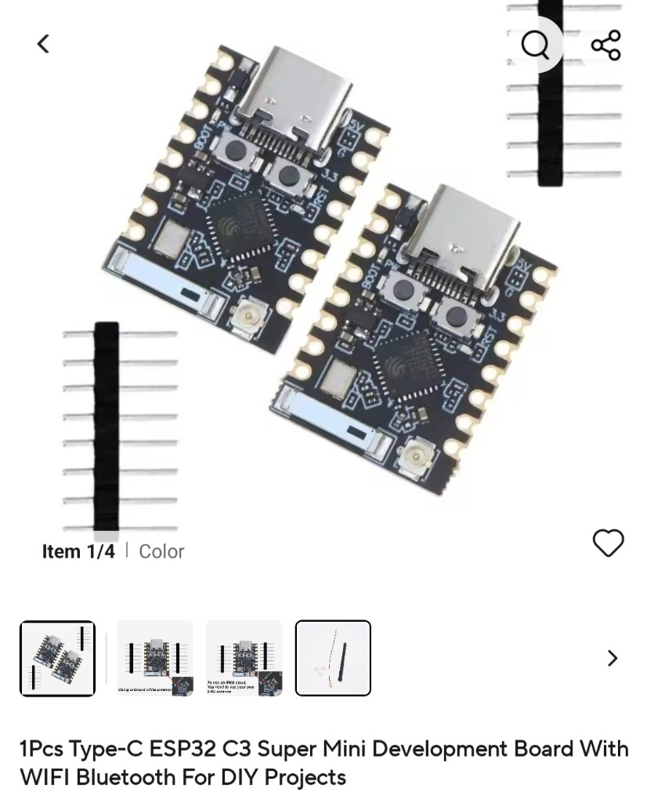
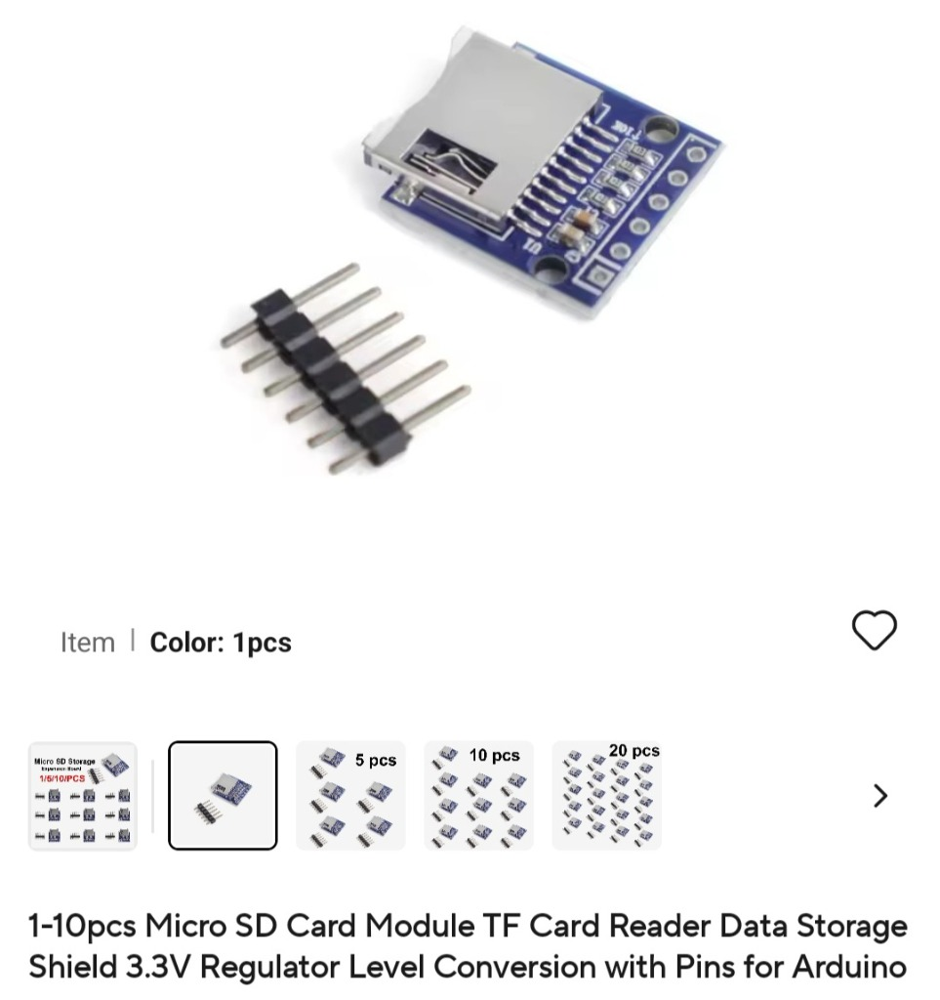
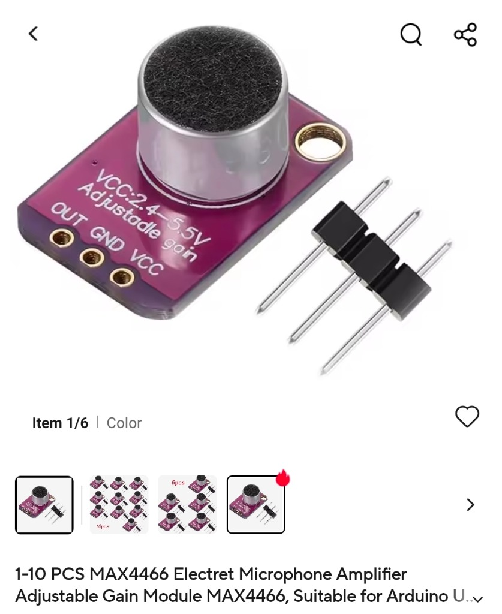
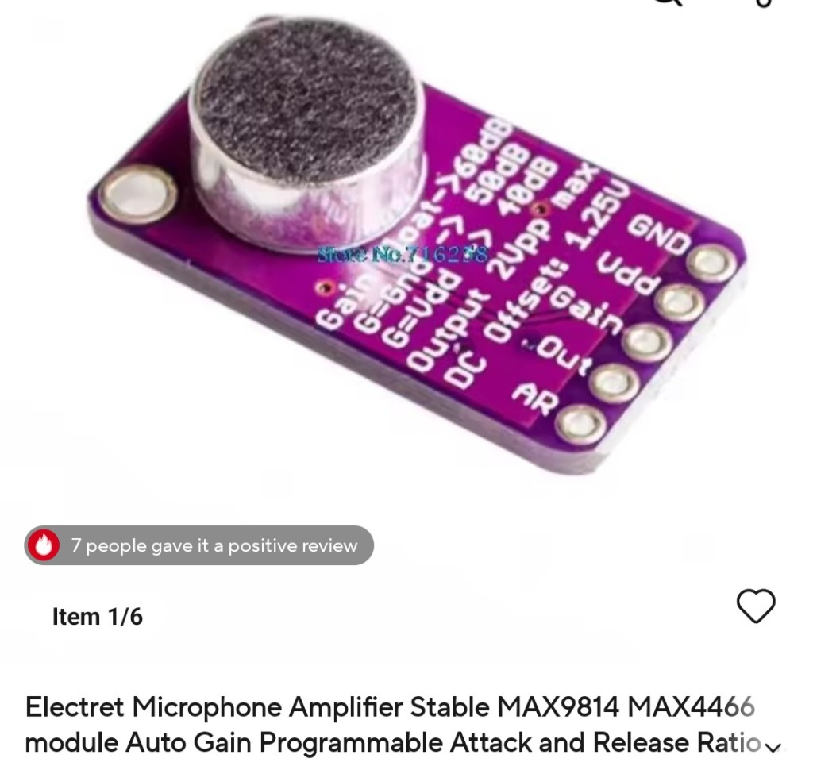

# FPV Microphone Activated by Radio Controller 🎙️🚁

An autonomous, ultra-low-latency voice/audio recording system for FPV drones. Powered by an **ESP32-C3 Super Mini** and an analog **MAX4466** or **MAX9814** microphone, recording directly to a MicroSD card in standard 16-bit PCM WAV format.

Recording is triggered seamlessly from a radio controller switch (AUX channel) via Betaflight `PINIO` resource remapping on a Flight Controller UART TX pin.

Includes an **integrated Wi-Fi Web Server** to stream, play, and download audio recordings directly to your smartphone on the field without ever removing the SD card!

---

## 📱 Wireless Phone Download (Wi-Fi Web Server)

You can download, listen to, and manage your recordings wirelessly on your phone without opening the drone or ejecting the MicroSD card:

1. **Connect to Wi-Fi**: On your smartphone, connect to the Wi-Fi network:
   * **SSID**: `FPV-Audio-Recorder`
   * **Password**: `12345678`
2. **Open Web Browser**: Navigate to `http://192.168.4.1` (in Safari, Chrome, etc.).
3. **Manage Audio Files**:
   * 🎧 **Listen/Play**: Play audio directly in the browser player.
   * 📥 **Download**: Save `.wav` files directly to your phone's storage.
   * 🗑️ **Delete**: Clean up old files to free space.

> [!IMPORTANT]
> **Zero RF Interference in Flight**: To protect your 2.4GHz RC receiver link (ELRS/Crossfire/FrSky), the ESP32 **automatically shuts off Wi-Fi (0mW RF output)** as soon as you flip the switch to record. Wi-Fi turns back on automatically when recording is stopped on the ground.

---

## Required Hardware (Components to Buy) 🛒

| Component | Image | Description |
| :--- | :--- | :--- |
| **ESP32-C3 Super Mini** |  | Ultra-compact development board with USB-C, 160MHz RISC-V processor, Wi-Fi/BLE, hardware timer, and ADC. |
| **MicroSD Card Module** |  | Standard Micro SD (TF) Card Reader Shield with SPI interface (3.3V power/logic). |
| **MAX4466 Microphone**<br>*(Option 1 - Manual Gain)* |  | Electret microphone amplifier with adjustable trimmer potentiometer on the back (dial counter-clockwise for minimum 25x gain). |
| **MAX9814 Microphone**<br>*(Option 2 - Auto Gain AGC)* |  | Electret microphone amplifier with hardware Automatic Gain Control (AGC). Solder `GAIN` to `VDD` for 40dB low-gain mode. |

---

## Supported Microphones (Drop-in Replacements)

You can choose either of the following two microphones (both connect to **GPIO 0** without any code changes):

### Option 1: MAX4466 (Adjustable Potentiometer)
- **Wiring**: `OUT` ➔ `GPIO 0`, `VCC` ➔ `3.3`, `GND` ➔ `G`.
- **Tuning**: Turn the small trimmer potentiometer on the back **counter-clockwise (left)** almost all the way down to dial the gain down to 25x (minimum) to prevent motor sound saturation.

### Option 2: MAX9814 (Automatic Gain Control - AGC)
- **Wiring**: `OUT` ➔ `GPIO 0`, `VDD` ➔ `3.3`, `GND` ➔ `G`.
- **Gain Setting**: Solder/bridge a short wire between the **`GAIN`** pin and the **`VDD`** pin. This locks the gain to **40dB (Minimum)**, enabling the hardware AGC to automatically compress loud motor noise while capturing clear audio without clipping.

---

## Hardware Wiring Table

| Component | Component Pin | ESP32-C3 Pin | Notes |
| :--- | :--- | :--- | :--- |
| **Microphone (MAX4466 or MAX9814)** | `VCC / VDD` | `3.3` | Regulated 3.3V Power |
| | `GND` | `G` (GND) | Shared Ground |
| | `OUT` | `0` (GPIO 0) | ADC1_CH0 Analog Input |
| | *`GAIN` (MAX9814 only)* | *`VDD` (Short)* | *Locks gain to 40dB (Minimum)* |
| **MicroSD SPI Module** | `VCC / 3v3` | `3.3` | 3.3V Power |
| | `GND` | `G` | Ground |
| | `MISO` | `5` | SPI MISO |
| | `MOSI` | `6` | SPI MOSI |
| | `SCK / CLK` | `4` | SPI SCK |
| | `CS` | `7` | SPI Chip Select |
| **Flight Controller** | `4.5V / 5V` | `5V` | Powered from FC (USB or LiPo) |
| | `GND` | `G` | Shared Ground |
| | `Spare TX Pad (e.g. TX1, TX2, TX3)` | `10` (GPIO 10) | 3.3V Logic Trigger Input |

---

## Features
- **Remote Control Trigger**: Start and stop recording on-the-fly using an AUX switch on your RC transmitter (e.g. EdgeTX/OpenTX/TBS/ELRS).
- **100% Video/Audio Sync**: Continuous background hardware-timer ADC sampling with ring-buffering guarantees zero dropped samples during SD card sector writes, keeping audio perfectly synchronized with 60fps/120fps action camera video.
- **Wireless Web Interface**: Stream, download, and delete files on your phone via Wi-Fi AP.
- **RF Safe Mode**: Wi-Fi automatically powers down during recording to guarantee zero interference with RC links in the air.
- **Real-time DSP Band-Pass Filter**: Filters out sub-audible frame vibrations (<150Hz) and high-frequency propeller whistle (>3400Hz) directly on the ESP32-C3 FPU.
- **Crash & Power-Loss Protection**: Periodically flushes data to the SD card so recordings remain intact even if the LiPo battery ejects during a crash.
- **Automatic File Indexing**: Automatically scans the SD card on boot to find the next available `/rec_N.wav` index, preventing accidental overwrites.

---

## Betaflight Setup: Step-by-Step PINIO Resource Remap

> [!NOTE]
> Every Flight Controller (FC) model uses different internal processor pin names (e.g., `A09`, `B06`, `C06`, `A02`). The MCU pin address is **not fixed** and depends on your specific FC board and which TX pad you choose to wire.

Follow this universal 4-step process for any Flight Controller:

### Step 1: Choose a Spare TX Pad
Pick any free, unused UART TX pad on your Flight Controller board (for example: `TX1`, `TX2`, `TX3`, `TX6`, etc.) and solder a wire from it to **Pin 10 (GPIO 10)** on the ESP32-C3.

### Step 2: Identify Your FC's Physical Pin in the CLI
1. Connect your flight controller to **Betaflight Configurator**.
2. Navigate to the **CLI** tab.
3. Type `resource` and hit **Enter**.
4. Scroll through the output and look for your chosen UART TX index:
   ```text
   resource SERIAL_TX <UART_NUMBER> <PIN_NAME>
   ```
   * *Example 1:* If you soldered to `TX1` and the CLI shows `resource SERIAL_TX 1 B06`, your pin is `B06`.
   * *Example 2:* If you soldered to `TX3` and the CLI shows `resource SERIAL_TX 3 B10`, your pin is `B10`.
5. **Note down your `<PIN_NAME>` and `<UART_NUMBER>`**.

### Step 3: Reassign the Pin as a Switchable GPIO (PINIO)
In the CLI, execute the following commands (replace `<UART_NUMBER>` and `<PIN_NAME>` with your values from Step 2):

```text
resource SERIAL_TX <UART_NUMBER> NONE
resource PINIO 1 <PIN_NAME>
set pinio_config = 1,129,129,129
set pinio_box = 40,255,255,255
save
```
*(The flight controller will save and reboot automatically).*

### Step 4: Map to an AUX Switch on Your Radio
1. Reconnect to Betaflight Configurator and open the **Modes** tab.
2. Locate the new **USER1** mode box in the list.
3. Click **Add Range** and choose your desired **AUX channel** corresponding to the switch on your radio transmitter.
4. Adjust the yellow slider so that flipping the switch to the active position activates `USER1` (the FC will output a steady 3.3V on the TX pad to trigger recording), and flipping it back deactivates it (0V on the TX pad to safely finalize and save the WAV file).
5. Click **Save** in the bottom right corner.

---

## Arduino IDE Settings
- **Board**: `ESP32C3 Dev Module`
- **USB CDC On Boot**: `Enabled` *(Essential for Serial Monitor output)*
- **Upload Speed**: `921600` or `115200`
- **Flash Frequency**: `80MHz`
- **MicroSD Format**: `FAT32`
